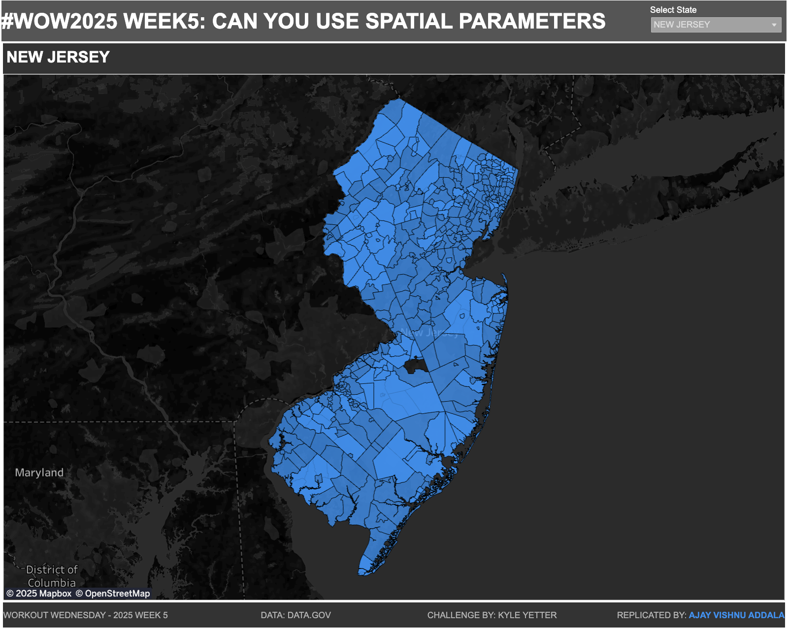

# Workout Wednesday 2025 - Week 5

This repository contains the solution for the Workout Wednesday Week 5 Tableau challenge: **Can You Use Spatial Parameters?**

## Introduction
This challenge explores the use of Spatial Parameters, a new feature in Tableau version 2024.3. The goal is to use spatial data to create interactive maps of school district boundaries and school locations, utilizing Spatial Parameters for dynamic filtering and interaction.

---

## Requirements
- **Canvas size**: 1000x800
- **Sheets**: 2

### Features:
1. A map displaying school district boundaries.
2. A state filter (school_district.Statename) to view one state at a time.
3. A map showing school locations.
4. A Spatial Parameter and parameter action to populate the parameter from the school district map.
5. A filter on the school location map based on the spatial parameter value.
6. Dynamic Zone Visibility to hide the school location map when no districts are selected.

---

## Dataset
This project uses public datasets from [data.gov](https://www.data.gov):

1. **School District Characteristics**
2. **School Neighborhood Poverty Estimates**

Note: We only use spatial data from these datasets.

---

## Dashboard Details
### Screenshot

### Tableau Public Link
Access the interactive dashboard here: [Tableau Public](https://public.tableau.com/views/SpatialParametersWOW2025W5/WOW2025W5?:language=en-US&:sid=&:redirect=auth&:display_count=n&:origin=viz_share_link)

---

## Resources
- [TableauTim's Introductory Video on Spatial Parameters](https://link_to_video)
- [Workout Wednesday Challenge](https://www.workout-wednesday.com)

---

